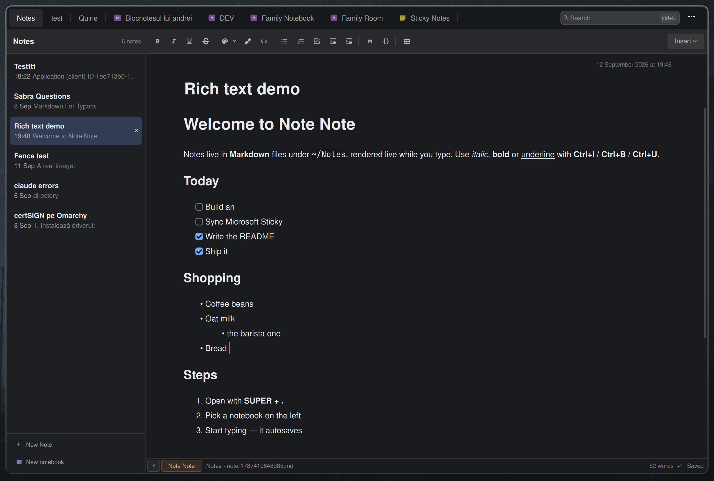

# Note Note

A notes sidebar for the Omarchy shell: notebooks on the left, the note on
the right, always editable and autosaved. Local Markdown notes, your
Microsoft Sticky Notes, OneNote and Notion pages all live in the same list.



**[Install](#install)** · **[Update](#update)** · **[Shortcut](#shortcut)** ·
**[Removal](#removal)** · **[Settings](#settings)** ·
**[Notebooks](#notebooks)** · **[Providers](#providers)** · **[Keys](#keys)**

## Install

```bash
omarchy plugin add https://github.com/andreivinca/omarchy-note-note.git
omarchy plugin enable io.github.andreivinca.note-note
```

Plugins land disabled so you can read the code first. It's QML plus small
Python scripts (standard library only); it talks to Microsoft Graph only
after you sign in, and like every Omarchy plugin it runs unsandboxed inside
your shell.

## Update

```bash
omarchy plugin update io.github.andreivinca.note-note
```

## Shortcut

Omarchy plugins don't register a shortcut on their own — bind one yourself:

```lua
-- ~/.config/hypr/bindings.lua
o.bind("SUPER + PERIOD", "Note Note", "omarchy-shell shell toggle io.github.andreivinca.note-note")
```

## Removal

```bash
omarchy plugin remove io.github.andreivinca.note-note
```

Your notes stay in `~/Notes/`. Two files are left behind on purpose, since
they're yours rather than the plugin's: `~/.local/state/omarchy/note-note.json`
(layout state) and, if you signed in to Microsoft,
`~/.local/state/omarchy/note-note-ms-*.json` plus the caches under
`~/.cache/omarchy/note-note-*`. Sign out from the sidebar first to drop the
token, or delete those files by hand.

## Settings

Click the gear left of **Detach** to edit note-note's own config directly as
JSON, saved with **Save** or `Ctrl+S`. It lives at
`~/.config/notenote/config.json` and is pre-filled with every setting on
first run.

- `providers.<id>.enabled` — hide a source (`local`, `sticky`, `onenote`,
  `notion`, or an external provider's own id) from the sidebar. Reordering
  the `providers` object reorders the sidebar tabs to match.
- `providers.local.notesDir` — where local notebooks live, overriding
  `~/Notes/` or `NOTE_NOTE_DIR`.
- `providers.<id>.notebookTabs` — `true` spreads a source's notebooks into
  a tab each down the left (how your local notebooks show by default);
  `false` folds them into one tab as an expandable tree (OneNote's
  default). Offered by the sources that have notebooks: `local` and
  `onenote` — Sticky Notes and Notion are a single flat list either way.

## Notebooks

Notebooks are folders under `~/Notes/` (override with `NOTE_NOTE_DIR`, or
the `providers.local.notesDir` setting); notes are Markdown files inside
them. Notes sitting directly in `~/Notes/` show up as a "Notes" notebook.
The title is stored in a front-matter block at the top of the file:

```
---
title: Shopping
---
milk, eggs
```

A note with no title shows the first words of its body in the list instead.

Each source and notebook gets its own tab down the left; click one, or
`Ctrl+Tab` through them. Whether a source's notebooks spread into a tab
each or fold inside a single tab is per source — the `notebookTabs`
setting; your local folders spread by default, OneNote folds. `+ New
note…` adds a note to the open notebook;
`+ New notebook…` makes one in your own notes (the only source that
supports it from here). Drag rows to reorder. Delete a note with the `×` on
its row. Rename or remove a notebook by renaming or removing its folder.

The body is Markdown, rendered live and saved back as Markdown, with a
formatting toolbar for headings, lists, tables, links, images and the usual
bold/italic/underline/strikethrough/highlight/code shortcuts (`Ctrl+B/I/U/S`,
`Ctrl+Shift+H`). Search filters by title as you type and by body a moment
later, where the backend allows it — OneNote and Notion are title-only,
since neither API exposes body search. **Detach** turns the overlay into an
ordinary window you can keep open beside your work; **Overlay** brings it
back.

## Providers

Every source of notes is a self-contained *provider* — a folder with a
`Provider.qml` implementing one small contract: rows for the sidebar,
`load` / `save` / `create` / `remove`, and a few capability flags.

- `providers/local/` — Markdown notebooks on disk
- `providers/sticky/` — Microsoft Sticky Notes
- `providers/onenote/` — OneNote
- `providers/notion/` — Notion
- `services/microsoft/` — Microsoft sign-in code shared by the above; each
  provider keeps its own token and scope, so signing out of one leaves the
  others signed in.

External providers go in
`~/.config/omarchy/note-note/providers/<id>/Provider.qml` — a plain
`git clone` into that directory is an install. The contract is documented
in [`providers/PROVIDERS.md`](providers/PROVIDERS.md); `examples/hello/` is
a minimal provider to start from.

## What it accesses

- **Your notes on disk**: `~/Notes` (or `NOTE_NOTE_DIR`) — nothing else on
  the filesystem beyond its own state and cache under
  `~/.local/state/omarchy/` and `~/.cache/omarchy/`.
- **Microsoft account, only after you sign in**: `Mail.ReadWrite` (Sticky
  Notes are stored in your mailbox), `Notes.ReadWrite` (OneNote), and
  `User.Read`. Each provider's token is separate and owner-only; signing out
  deletes only that one. The plugin talks to `login.microsoftonline.com` and
  `graph.microsoft.com` and nowhere else.

Developer-facing documentation (architecture, security rules, testing,
releases) lives in [`docs/`](docs/README.md).

## Keys

| Key | Action |
|---|---|
| `Esc` | clear search, else close (saves first) |
| `Ctrl+N` | new note in the current notebook |
| `Ctrl+Shift+N` | new notebook |
| `Ctrl+Tab` / `Ctrl+Shift+Tab` | next / previous notebook tab |
| `Ctrl+K` | search |
| `Ctrl+D` | delete current note |
| `Ctrl+B` / `Ctrl+I` / `Ctrl+U` / `Ctrl+S` | bold / italic / underline / strikethrough |
| `Ctrl+Shift+H` | highlight the selection |
| `Ctrl+↓` / `Ctrl+J` | next note |
| `Ctrl+↑` | previous note |
